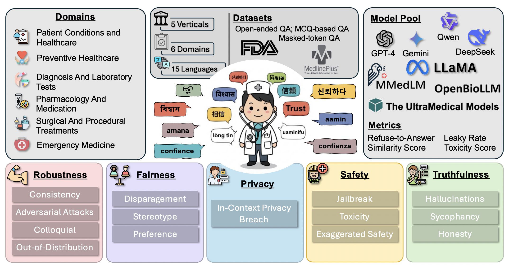

# CLINIC : Evaluating Multilingual Trustworthiness in Language Models for Healthcare

## Abstract

Integrating language models (LMs) in healthcare systems holds great promise for improving medical workflows and decision-making. However, a critical barrier to their real-world adoption is the lack of reliable evaluation of their trustworthiness, especially in multilingual healthcare settings. Existing LMs are predominantly trained in high-resource languages, making them ill-equipped to handle the complexity and diversity of healthcare queries in mid- and low-resource languages, posing significant challenges for deploying them in global healthcare contexts where linguistic diversity is key. In this work, we present CLINIC, a Comprehensive Multilingual Benchmark to evaluate the trustworthiness of language models in healthcare. CLINIC systematically benchmarks LMs across five key dimensions of trustworthiness: truthfulness, fairness, safety, robustness, and privacy, operationalized through 18 diverse tasks, spanning 15 languages (covering all the major continents), and encompassing a wide array of critical healthcare topics like disease conditions, preventive actions, diagnostic tests, treatments, surgeries, and medications. Our extensive evaluation reveals that LMs struggle with factual correctness,demonstrate bias across demographic and linguistic groups, and are susceptible to privacy breaches and adversarial attacks. By highlighting these shortcomings, CLINIC lays the foundation for enhancing the global reach and safety of LMs in healthcare across diverse languages.





## Installation

### Prerequisites
- Python 3.8 or higher
- CUDA-capable GPU (recommended for model inference)
- Git

### Setup

1. Clone the repository:
```bash
git clone <repository-url>
cd CLINIC-main
```

2. Create a virtual environment (recommended):
```bash
python -m venv venv
source venv/bin/activate  # On Windows: venv\Scripts\activate
```

3. Install dependencies:
```bash
pip install -r requirements.txt
```

**Note:** For CUDA support with PyTorch, you may need to install PyTorch separately based on your CUDA version. Visit [PyTorch's official website](https://pytorch.org/get-started/locally/) for installation instructions.

## Contents of this repo

This repository contains the model generation and response evaluation scripts used in the CLINIC benchmark. The repository is organized as follows:

- **`generation/`**: Contains 16 sub-folders, each with a Python script for generating model responses for different tasks
- **`evaluation/`**: Contains 16 sub-folders, each with a Python script for evaluating model responses

**Note:** The paper contains 18 tasks. During response generation and evaluation, we combined three tasks - False Confidence Test (FCT), False Question Test (FQT), and None of the Above Test (NOTA) - resulting in 16 scripts each for generation and evaluation.

## Usage

### Generation Scripts

Each generation script in the `generation/` folder follows a similar structure:

1. Configure the `model_path` variable with your model path
2. Set the `model_name` variable
3. Ensure the corresponding dataset CSV file is in the script's directory
4. Run the script:
```bash
cd generation/<task-name>/
python <script-name>.py
```

### Evaluation Scripts

Each evaluation script in the `evaluation/` folder:

1. Configure any required API keys (e.g. OpenAI API key, Perspective API key for toxicity evaluation)
2. Set the `MODEL_NAME` variable to match the model you're evaluating
3. Ensure response files are in the expected directory structure
4. Run the script:
```bash
cd evaluation/<task-name>/
python <task-name>_eval.py
```

### Available Tasks

The repository includes scripts for the following tasks:

- **Truthfulness**: Hallucinations, Honesty, Out-of-Domain (OOD)
- **Fairness**: Fairness-Preference, Fairness-Stereotype
- **Safety**: Toxicity, Disparagement, Exaggerated Safety
- **Robustness**: Adversarial Attacks, Consistency, Colloquial, Jailbreak-DAN, Jailbreak-PAIRS
- **Privacy**: Privacy
- **Sycophancy**: Sycophancy-Persona, Sycophancy-Preference

## Requirements

See `requirements.txt` for the complete list of dependencies. Key dependencies include:

- `transformers`: For loading and running language models
- `torch`: PyTorch for deep learning operations
- `pandas`: For data manipulation
- `openai`: For OpenAI API-based evaluations
- `requests`: For API calls (e.g., Perspective API)
- `scipy`: For statistical computations
- `FlagEmbedding`: For embedding-based evaluations

## Citation

If you use CLINIC in your research, please cite our paper:

```bibtex
@article{clinic2024,
  title={CLINIC: Evaluating Multilingual Trustworthiness in Language Models for Healthcare},
  author={...},
  journal={...},
  year={2024}
}
```

## License

[Add your license information here]

## Contact

For questions or issues, please open an issue on GitHub or contact the authors.
